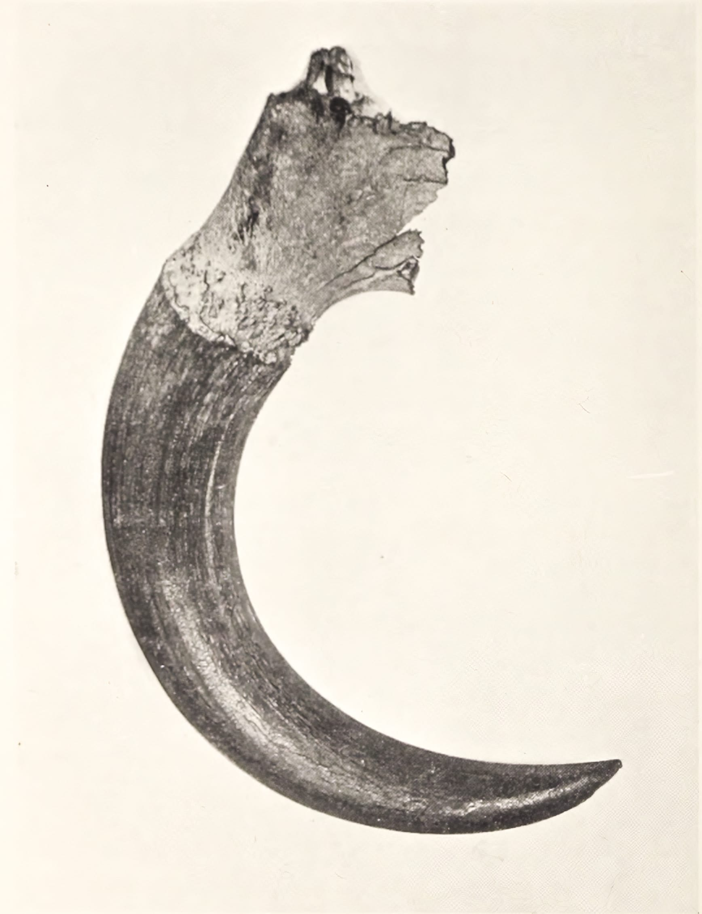
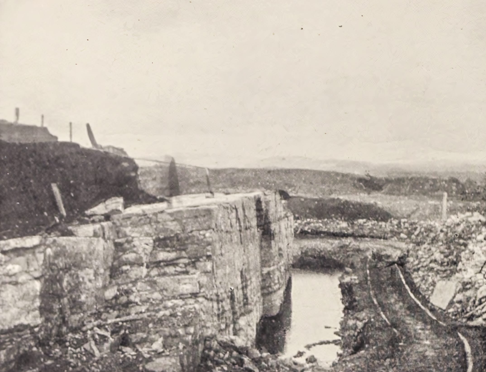

# IV. The Geology of the Parish

The parish of Neilston is traversed by a great valley, which, under different names, extends from the level land in the northeast, where it is bounded by the parishes of Paisley and Eastwood, to where it marches with the parishes of Dunlop and Beith in the south-west. The eastern portion of this valley may be considered as passing through Hurlet, Nitshill, and Darnley, and here it is between two and three miles wide. From this it gradually converges as it passes up the stream of the Levern until it reaches to within about half a mile of Neilston station on the Joint Line of the railway; and at this point, it narrows in so rapidly that, by the time it reaches the station, the trap formations on either side have met. From this point, the outlet of the valley towards the west is through a comparatively narrow break in the trap, known as Cowden Glen, which extends south-westward for about a mile, and is about a hundred feet wide. The boundary of this glen on the north side is a continuation of the porphyrite traps of Gleniffer Hills, which here rise as a bold escarpment to the height of about eighty feet; the southern boundary is a more recent formation of volcanic ash and tuff, and in it several eruptive dykes have been exposed through the alteration on the turnpike road rendered necessary by the construction of the Joint Line to Kilmarnock.

<figure>
    
    <figcaption>Horn and upper part of skull of Bos Primigenius, found in interglacial beds in Cowden Glen, Neilston</figcaption>
</figure>

Emerging from this comparatively narrow ravine, the valley begins gradually to widen out again, passing westward through Shillford, Loch Libo, Caldwell, and Lugton sections. Beyond Caldwell, it again broadens out, until, in the neighbourhood of Lugton, where it enters into the parishes of Dunlop and Beith, it attains a width of about three miles and merges into the carboniferous formations of the Dairy basin. It will thus be seen that, as regards general outline, the valleys of Levern and Lugton, viewed together, bear some resemblance to a gigantic sandglass, two or three miles wide at the eastern and western extremities respectively, but narrowing to about a hundred feet in the middle, where the trap formations meet in Cowden Glen. About the west end of* this short glen the trap suddenly dips, by a fault, to about sixty feet, the depression or blank thus caused being filled up with boulder clay, whilst the hollows on the surface are filled up with stratified deposits of sand, mud, and peat, evidently, the remains of an old lake, being one of a series of lakes, which it appears had at one time occupied the valley from this point to Caldwell, the present Loch Libo being the only one of the series now remaining.

Mr James Binnie, of the Geological Survey of Scotland, speaking of this formation, says:—“Up to 1867 the picturesque little valley of Cowden beyond Crofthead on the road to Ayrshire, was not known to possess any features of special geological interest, but in that year, having been chosen as the route of the district railway to Kilmarnock, it was invaded by the navvy with pick and shovel to the utter destruction of all its natural beauties. The gradients being steep, the excavations were extensive, and at one point the bed of an ancient lake was cut through, containing deposits of mud and peat lying between two distinct layers of boulder clay. These stratified deposits were found to contain numerous remains of vegetable and animal life, both of higher and lower forms.”

In the opening up of these stratified lacustrine beds, the following fossil fauna was found near to the trap fault already referred to,— the skull and horn-core of the *Bos primigenius* (this interesting relic has now found a home in Caldwell House); part of the horn of the extinct Irish elk, *Megaceros hibernicus*, and a few bones of the horse, *Equus caballus*. The horn-core of the *bos primus* was lying near the centre of the railway cutting, about six feet from the surface, while the antlers and fragments of the Irish elk were about thirty feet further into the hillside, and fifteen feet from the surface. The fossil flora was represented by, besides mosses and a sedge, *Scirpus lacustris*, branches of *Betula alba*, leaves of the *Salix alb*a, twigs of *Calimun vulgaris*, and *Vaccinum myrtillus*.

Through this great valley and closely alongside the Joint Line Railway, the main turnpike road from Glasgow and Paisley passes through the parish into Ayrshire and divides at Lugton into two principal roads, one leading to Kilmarnock and the other to Irvine. At the north-eastern boundary of the parish, the Levern valley as thus defined becomes sub-divided by a thick ridge of sandstone, which runs from nearly opposite Darnley Hospital to Barrhead, and along Craighead's, to the west of Barrhead; and each sub-valley has its own watercourse.

This ridge makes a great break in the carboniferous strata with which the main valley is filled, with the consequence that the beds on the north side of the ridge are lower in the series than those exposed on its south, which crop out against the sandstone, giving a displacement, possibly of about sixty fathoms, near Darnley. The trough of the southern sub-valley narrows towards its termination at Colinbar Glen, near Wraes Mill. Various beds of sandstone, coal shale, clay shale, oil shale, ironstone. and others, from a depth of over 175 fathoms, crop out on either side of the valley against the trap formations, and in some places lie at such an acute angle to them, as against the Fereneze ash, as to show that these valley troughs have been formed by the bursting upwards through their beds of the volcanic eruption, which now in the form of the trap formation constitutes the northern and southern hill ranges forming the boundaries already referred to in the configuration of the parish. The carboniferous limestone of the valley yields many fossils belonging to the following classes, viz.:—*Plantae, Zoophyta*, *Echinodermata*, *Annelida*, *Crustacea*, *Brachiopoda*, *Lamelli-branchiata*, *Gasteropoda*, *Pteropoda*, *Cephalopoda*, and *Pisces*. During the recent formation of the Lanarkshire and Ayrshire Railway, which passes through the parish from its eastern to its western border, the excavations and cuttings exposed formations very varied in character; trap and ash tuff, blue and boulder clay, the latter containing boulders of various sizes—round and sub-angular—amongst which the writer picked up a small, evidently carried, quartz, which had a number of small pieces of gold embedded in it.

In a field known as the Wellpark, and situated behind and to the east of Brig o’ Lea, a considerable section of sand bed was passed through distinctly stratified in character, and evidently the remains of some ponded up body of water. In the rock-cutting at the south side of the entrance to Midge Glen, which was wrought by the contractor as a quarry for ballast until the railway was quite finished, it was observed that the whinstone was distinctly columnar in its arrangement when exposed, and at the east end of the same section, the friable volcanic ash was seen to underlie the more solid stone, the latter having evidently flowed out over it when in its liquid condition, as if the froth and ash of the volcano had first boiled up and overflowed, and been then itself covered over with the more consistent stream, which ultimately on cooling formed the bulk of the erupted mass of which the hill is composed. On Cowdenmoor farm, and about two hundred yards east of the bridge across the railway, on the road leading from Uplawmoor to Shillford, and on the south bank of the line, there is exposed a large boulder well glaciated, the striae having a direction from north-east to south-west; whilst at the east end of the village of Uplawmoor, where the line passes through the skirt of the plantation there, and for some distance westward, under ten feet of peat, a bed of boulder clay was exposed, laden with boulders of different sizes, mostly sub-angular, and many of them striated, resting on an outcrop limestone consisting mostly of fossil shells, and stems of encrinites at its eastern exposure. In passing through Pollick farm, westward of Uplawmoor, the formation of the railway was entirely through limestone, which is continued beyond the boundary of the parish to the limestone quarries of Lugton and Beith.

<figure>
    
    <figcaption>The working face of the glaciated lime-stone which shows the striated surface in Lugton Quarry</figcaption>
</figure>

At this point, I think it proper, as it is connected with the limestone under consideration, although just beyond the boundary of the parish, to refer to a very remarkable exposure of glaciated surface in the lime quarry on Waterland farm at Lugton. In 190G the workmen, for blasting purposes, had to bear the limestone of topsoil of about eight or nine feet in thickness, and on this being cleared away there was exposed a broad platform of stone, having a highly polished and gently undulating surface, with a slight dip to the south-west. The dimensions of the surface thus laid bare were about thirty feet by fifteen; but it was observed that the same character of the surface was continued under the still unremoved soil of the field, to what extent was unknown. The glaciation of this surface was quite remarkable for its high polish, and when wet or washed clean, it shone with quite a glassy lustre. But besides, and constituting a marvellous addition to its interest, the whole exposure was marked with striations or groovings, some deeper, some shallower, and many very fine scratchings, but all clearly and definitely cut in long parallel lines, and all trending from north-east to south-west, and the undulations on the surface crossed these striations. At the western end of the exposure, the natural surface of the stone dipped gently down towards the west, and was unworn and rough, apparently indicating that the polished surface represented some boss of rock that had been ground off; and at places where this terminated somewhat abruptly, there was found in the depressions, clay, containing bones, boulders, and other deposits, huddled together. Shining everywhere through this beautiful surface were the fossil remains of many marine structures, shells, and crustaceans, cut through at all angles, and the outlines of very large animals were clearly defined, while bones and teeth were frequently met with, the whole surface presenting the unmistakable evidence of long bygone and long-continued glacial action. In connection with glacier grooving, it may be further pointed out, that when the alteration was made in the turnpike road at the west end of Loch Libo, during the formation of the railway there in 18G7, on baring the sandstone 011 the south side of the road, there were several very pronounced gutters exposed in the surface of the stone, running north-east and south-west. These markings were about three inches wide, and fully an inch deep. At the east end of the loch, and near the gravel quarry on the farm, Head of Side,” there is an “osar,” or sandhill, quite as circular in form as the track of a circus, “ the fairy ring,” a relic no doubt of early glacier movement, or a once larger lake than the present Loch Libo.

## Topography of the Parish

In its physical features, most of the land of the parish may be said to lie along the hill ranges situated south and north of the Levern Valley. As has been already pointed out, this valley passes through the parish from northeast to southwest, and the general trend of the hill ranges is in the same direction.

To the north is the Fereneze range, which, by Capellie, Lochliboside, and Caldwell, continues into Ayrshire. At Caldwell it spreads out into a broad tableland, having Corkindale and Caldwell Laws as its most conspicuous elevations, the former rising to a height of 848 feet, and the latter to 800 feet above the mean level of the sea. From these heights, spreading in a north-westerly direction, the land becomes continuous with the parishes of Lochwinnoch and Beith. To the south of the valley, the land begins to rise from Craighead's at Barrhead and continues to increase in elevation as it extends south and west until it also spreads out into a broad tableland through moss and rough pasturage into that of the parishes of Mearns. Stewarton, and Dunlop. In the direction of Kingston, where the water-shedding is reached, the old turnpike road rises by a succession of long step-like elevations, which clearly indicate their trap formation.

The most prominent elevations in this westward progress are the trap formations of Craig of Carnock, on the borderland of Mearns parish; Neilston Pad, also of igneous origin; How-Craigshill, south of Uplawmoor Road; Dumgrain and Knockanae, both north of Kingston Road;

### Views from Hilltops

Cannon Hock and Durduffhill, both south of Kingston Hoad; Knock-maid, south of Uplawmoor, all rising on igneous formations more or less interstratified. These hill ranges rise with a varying but gentle acclivity from the level of the Levern valley to Kingston, in the parish of Dunlop. In the east of the parish beyond Barrhead, the valley gradually opens out, and becomes continuous with the comparatively level land that passes on to the Clyde; whilst westward through its Lugton section, it reaches the Firth of Clyde by the broad alluvial lands that stretch onward to Ardrossan and the Ayrshire coast.

### Views from Hilltops Around Neilston

The views that are to be obtained from several of the most prominent hilltops in the parish are as varied as they are grand and extensive. From Craig of Carnock, and from its more gigantic neighbour, The Pad— so named from its fancied resemblance to the cushion or pad ladies were wont to sit on when riding behind gentlemen on horseback, a familiar enough practice in the days of our grandfathers, when vehicles were less common than they are now—the broad valley through which the Clyde passes, lies spread out before the observer, from the east of the parish to the Campsie and Kilpatrick ranges, including Campsie Fell and Glen, with the wide-spreading city of St. Mungo, and the numerous towns and villages surrounding it stretched out between.

Nor does the broad prospect end here, for in early spring when the distant sky is clear, and the hilltops of the Grampians are covered with snow, the whole range from Ben Lomond to Schiehallion, including Ben Arthur and its neighbours, Ben Cruachan, Ben More, Ben Lawers, Ben Voirlech, Ben Nevis, and very many others, come within the extensive prospect.

But the view from the top of Corkindale Law at Lochliboside, for extent and grandeur, is unsurpassed by any hill of equal height in Scotland, so wide and varied is the prospect it affords. Its summit is quite green, and the ascent to it is so gradual that, 011 reaching it, one can scarcely realize that such a height has been attained, and if the day is favourable, the labour entailed in attaining it is amply rewarded, so great is the range of vision. To the north the Kilpatrick range, and the Vale of Leven, Loch Lomond, with a number of its islands, and the great Ben Lomond towering over it, and dominating the whole scene; Ben Ledi, the “Cobbler,” and a host of other hilltops. Mount Tinto in the east, with the towns and villages that intervene; and in the south and west the fertile lands of Ayrshire, and the coastline down to the Rhinns of Galloway. Dahnellington and Cumnock hills, the heights of Kirkcudbright, and the massive range of Saddleback, and Scafell in England, in the Lake District of Cumberland and Westmoreland, are dimly visible, with the Trostan and northern hills of Ireland; while in the west and south-west, the grandeur of the prospect is more immediate. Eglinton Castle in its surrounding woods, the shore by Ayr bay, Troon, and Ardrossan, Arran, and Ailsa, in their watery surroundings, while sailing vessels and gigantic ocean liners on the waters of the firth give animation to the scene. With Kilbirnie hills, Mistylaw, and the heights of Kilmacolm in the nearer view, altogether they make up a prospect of unsurpassed interest and grandeur.